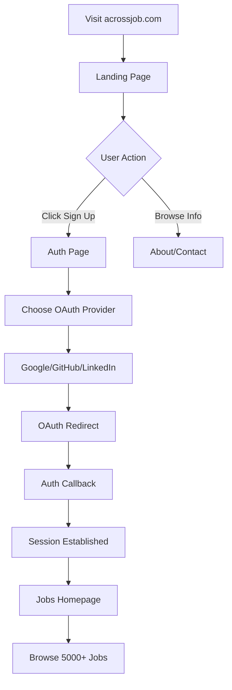

# AcrossJobs - Job Board Platform

<div align="center">

[](https://www.typescriptlang.org/)
[](https://reactjs.org/)
[](https://supabase.com/)
[](https://www.cloudflare.com/)

**A modern, high-performance job board platform with social authentication**

[Live Demo](https://acrossjob.com) • [Documentation](./AUTHENTICATION_SETUP.md)

</div>

---

## ✨ Features

### 🔐 Authentication & Security
- **Social Login**: Google, GitHub, LinkedIn (Azure AD)
- **Protected Routes**: Jobs require authentication
- **Session Management**: Persistent user sessions
- **OAuth 2.0**: Secure third-party authentication

### 💼 Job Listings
- **5,000+ Active Jobs**: Curated opportunities across industries
- **7 Categories**: IT, Sales, Marketing, Finance, Legal, Management, R&D
- **Smart Filtering**: Filter by category, location, job type
- **Real-time Search**: Instant search across all listings
- **Pagination**: Optimized loading for thousands of jobs

### ⚡ Performance
- **SSR (Server-Side Rendering)**: Fast initial page load
- **Edge Caching**: 5-minute cache on Cloudflare Edge
- **Background Loading**: Load 500 jobs initially, then fetch all in background
- **Optimized Queries**: Efficient database pagination

### 🎨 User Experience
- **Landing Page**: Beautiful hero section with CTAs
- **Responsive Design**: Works on all devices
- **Smooth Navigation**: Client-side routing with history API
- **Loading States**: Visual feedback during data fetch

---

## 🛠️ Tech Stack

| Layer | Technology |
|-------|------------|
| **Frontend** | React, TypeScript, TailwindCSS |
| **Backend** | Cloudflare Pages Functions (Workers) |
| **Database** | Supabase (PostgreSQL) |
| **Authentication** | Supabase Auth (OAuth 2.0) |
| **Deployment** | Cloudflare Pages |
| **Edge Cache** | Cloudflare Cache API |

---

## 🚀 Quick Start

### Prerequisites

- Node.js 18+
- npm or yarn
- Supabase account
- Cloudflare account

### Installation

1. **Clone the repository**
   ```bash
   git clone https://github.com/Anuj472/acrossjobs.git
   cd acrossjobs
   ```

2. **Install dependencies**
   ```bash
   npm install
   ```

3. **Create environment file**
   ```bash
   cp .env.example .env.local
   ```

4. **Configure environment variables**
   ```env
   VITE_SUPABASE_URL=https://your-project.supabase.co
   VITE_SUPABASE_ANON_KEY=your-anon-key
   ```

5. **Run development server**
   ```bash
   npm run dev
   ```

6. **Open browser**
   ```
   http://localhost:5173
   ```

---

## 🔐 Authentication Setup

**IMPORTANT**: Social login requires OAuth configuration in Supabase.

Follow the detailed guide: [AUTHENTICATION_SETUP.md](./AUTHENTICATION_SETUP.md)

### Quick Setup Checklist

- [ ] Create Google OAuth app
- [ ] Create GitHub OAuth app  
- [ ] Create Azure AD app (for LinkedIn)
- [ ] Configure OAuth apps in Supabase
- [ ] Set Site URL in Supabase
- [ ] Add redirect URLs
- [ ] Test each provider

---

## 📚 Project Structure

```
acrossjobs/
├── pages/                  # React pages
│   ├── Landing.tsx         # Landing page (public)
│   ├── Auth.tsx            # Authentication page
│   ├── AuthCallback.tsx    # OAuth callback handler
│   ├── Home.tsx            # Jobs homepage (protected)
│   ├── CategoryPage.tsx    # Category filtering (protected)
│   └── JobDetailPage.tsx   # Job details (protected)
├── components/           # React components
├── functions/            # Cloudflare Pages Functions
│   └── [[path]].tsx        # SSR handler
├── db/                   # Database utilities
├── lib/                  # Supabase client
├── App.tsx               # Main app with routing
└── index.tsx             # Entry point
```

---

## 🔄 User Flow



---

## 📄 API Routes

| Route | Description | Auth Required |
|-------|-------------|---------------|
| `/` | Landing page | No |
| `/auth` | Login/Sign up | No |
| `/auth/callback` | OAuth redirect | No |
| `/jobs` | Jobs homepage | **Yes** |
| `/jobs/:category` | Category filter | **Yes** |
| `/jobs/:category/:id` | Job details | **Yes** |
| `/about-us` | About page | No |
| `/contact` | Contact page | No |

---

## 🛡️ Security Features

- ✅ OAuth 2.0 authentication
- ✅ Protected API routes
- ✅ Session-based access control
- ✅ Environment variable security
- ✅ HTTPS only (enforced by Cloudflare)
- ✅ Row Level Security (RLS) in Supabase

---

## 📊 Performance Optimizations

### Initial Load (SSR)
- Load **500 jobs** server-side
- Render HTML with initial data
- Cache for 5 minutes on edge
- ~2-3 second page load

### Background Load (Client)
- Fetch **ALL remaining jobs** after page renders
- Use Supabase pagination (1000 per batch)
- Show loading indicator
- Complete catalog available in 5-10 seconds

### Caching Strategy
```
Edge Cache (Cloudflare)
  ↓ 5 minutes
SSR Data (500 jobs)
  ↓ Fast initial render
Client Load (All jobs)
  ↓ Complete catalog
```

---

## 🐛 Known Issues

- [ ] Email/password auth not implemented (only social login)
- [ ] Password reset flow not available
- [ ] User profile page pending
- [ ] Job application tracking not implemented

---

## 🛣️ Roadmap

### Phase 1: Core Features ✅
- [x] Landing page
- [x] Social authentication
- [x] Job listings
- [x] Category filtering
- [x] Search functionality

### Phase 2: User Features 🚧
- [ ] User profile
- [ ] Save favorite jobs
- [ ] Job application tracking
- [ ] Email notifications

### Phase 3: Admin Features 📅
- [ ] Admin dashboard
- [ ] Bulk job upload
- [ ] Analytics dashboard
- [ ] User management

---

## 📦 Deployment

### Cloudflare Pages

1. **Connect GitHub repository**
   - Go to Cloudflare Dashboard
   - Pages → Create Project → Connect to Git

2. **Build settings**
   ```
   Build command: npm run build
   Build output directory: dist
   ```

3. **Environment variables**
   ```
   SUPABASE_URL=https://your-project.supabase.co
   SUPABASE_ANON_KEY=your-anon-key
   ```

4. **Deploy**
   - Push to `main` branch
   - Auto-deploy on every commit

---

## 📝 License

MIT License - see [LICENSE](LICENSE) for details

---

## 👥 Contributing

Contributions welcome! Please:

1. Fork the repository
2. Create a feature branch
3. Commit your changes
4. Push to the branch
5. Open a Pull Request

---

## 📧 Support

- **Issues**: [GitHub Issues](https://github.com/Anuj472/acrossjobs/issues)
- **Discussions**: [GitHub Discussions](https://github.com/Anuj472/acrossjobs/discussions)
- **Email**: support@acrossjob.com

---

<div align="center">

**Built with ❤️ by AcrossJobs Team**

[Website](https://acrossjob.com) • [Twitter](https://twitter.com/acrossjobs) • [LinkedIn](https://linkedin.com/company/acrossjobs)

</div>
